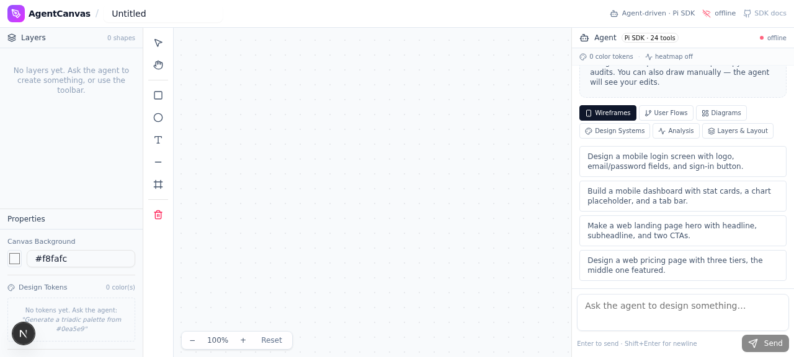
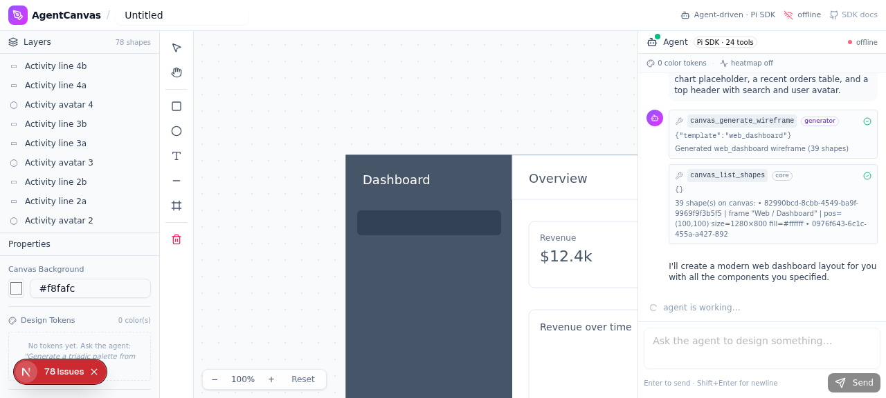
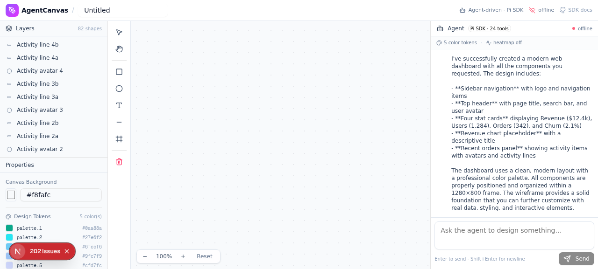
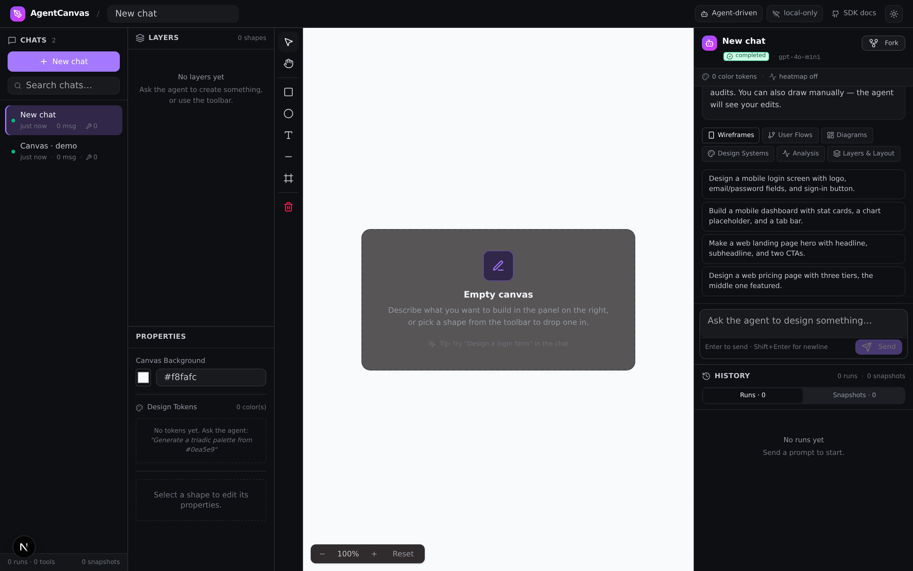
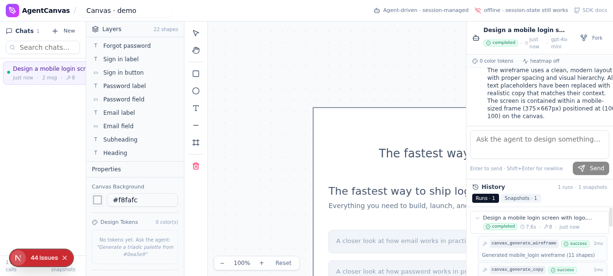

<div align="center">

# AgentCanvas

**An AI-native collaborative canvas — Figma for AI agents.**

Chat in plain English → the agent reasons, calls tools, and draws the design for you. Live, on an infinite SVG canvas, with real-time multiplayer presence.

[](https://github.com/kanishka-namdeo/co-canvas/actions/workflows/ci.yml)
[](https://opensource.org/licenses/MIT)
[](https://nextjs.org/)
[](https://react.dev/)
[](https://www.typescriptlang.org/)
[](https://www.prisma.io/)

</div>

---

## ✨ What is this?

`co-canvas` flips the usual design-tool script: **the AI agent is the canvas's primary user**, and you're the director. Instead of dragging rectangles around, you write prompts like:

> *"Design a mobile login screen with social sign-in options, then generate a 3-screen onboarding flow that follows it."*

…and watch the agent plan, call ~50 typed canvas tools, and stream patches onto an infinite DOM-rendered canvas in real time. You can jump in any time with the manual toolbar, properties inspector, and layers panel — everything stays in sync.

Think **Excalidraw + Figma + an AI pair designer**, running locally.

---

## 🎬 Screenshots

| The workspace | Agent thinking | Dashboard generated |
| :---: | :---: | :---: |
|  |  |  |

| Dashboard generated | Dark mode | Session history |
| :---: | :---: | :---: |
|  |  |  |

> More screenshots in [`download/`](./download/) — including a full dashboard-generation walkthrough and session-management demo.

---

## 🚀 Features

### 🤖 AI agent at the wheel
- **Natural-language → canvas.** Type a prompt; the agent plans + executes a sequence of typed tool calls.
- **60+ `.pen`-aligned tools** — shapes, layers, groups, component instances (refs + descendant overrides), slots, Auto Layout (flexbox), variables (theme-conditional `$name`), multi-axis themes, gradients, shadows, blur, masks, boolean ops, freeform paths.
- **One-shot generators** — wireframes (mobile/web), multi-screen user flows, flowcharts, mindmaps, color palettes.
- **AI analysis** — design audit (color/type/contrast/alignment), AI copy generation.
- **Streaming responses** — agent thoughts + tool-call cards stream in live, `.pen` tree mutations happen as you watch.

### 🎨 Full design tool, not just a toy
- **Infinite SVG canvas** — pan (middle-mouse / space-drag), zoom (wheel), 8-handle resize, drag-move, delete-to-remove.
- **Manual toolbar** — rectangle, ellipse, text, line, frame, group; select / pan / clear modes.
- **Properties inspector** — geometry, fill/stroke, radius, opacity, rotation, text, Auto Layout editor, multi-select align/distribute.
- **Layers panel** — z-order, visibility, lock, component-instance badges, token-binding dots, right-click context menu.
- **Design tokens** — named colors + text styles; bind shapes to tokens so changing a token recolors everything bound to it.
- **Dark mode** — full `--ac-*` token system, switchable via the header toggle.

### 🔄 Real-time + persistent
- **Multi-viewer collaboration** — Socket.IO broadcasts every patch + agent event to all subscribers, with live viewer-count presence.
- **Session history** — Sessions → Runs → Messages → ToolCallRecords → Snapshots, persisted to `localStorage`.
- **Fork & restore** — branch a session from any past message, or restore a snapshot (append-only — never destroys history).
- **Run lifecycle** — OpenAI-Assistants-style state machine (queued → in_progress → awaiting_tool → completed/failed/cancelled) with a Stop button.
- **Local-only fallback** — if the Socket.IO service is down, the client POSTs directly to `/api/agent` so the app still works end-to-end.

### 📤 Export & handoff
- Export to **JSON / SVG / PNG**.
- **Copy as code** — generate HTML, React, or Tailwind from a selection.

---

## 🧱 Tech stack

| Layer | Tech |
| --- | --- |
| Framework | [Next.js 16](https://nextjs.org/) (App Router, standalone build) |
| UI | [React 19](https://react.dev/), [TypeScript 5](https://www.typescriptlang.org/), [Tailwind 4](https://tailwindcss.com/), [shadcn/ui](https://ui.shadcn.com/), [Radix UI](https://www.radix-ui.com/) |
| State | [Zustand 5](https://zustand.docs.pmnd.rs/) (canvas store + session store, persisted to `localStorage`) |
| Realtime | [Socket.IO 4](https://socket.io/) (in-process or standalone mini-service on port 3003) |
| Database | [Prisma 7](https://www.prisma.io/) + SQLite (Documents, Shapes, AgentActions) — via `@prisma/adapter-libsql` driver adapter |
| AI agent | [`@earendil-works/pi-coding-agent`](https://www.npmjs.com/package/@earendil-works/pi-coding-agent) + [`z-ai-web-dev-sdk`](https://www.npmjs.com/package/z-ai-web-dev-sdk) (OpenAI-compatible LLM shim) |
| Validation | [Zod 4](https://zod.dev/), [@sinclair/typebox](https://github.com/sinclairzx/typebox) (tool schemas) |
| Testing | [Vitest 4](https://vitest.dev/) + [@testing-library/react](https://testing-library.com/) |

---

## 🏗️ Architecture

```
┌─────────────────────────────────────────────────────────────────┐
│                            Browser                              │
│                                                                 │
│   ┌──────────────┐   ┌──────────────┐   ┌──────────────────┐   │
│   │ React UI     │   │ canvas store │   │ session store    │   │
│   │ (Next.js)    │◄─►│ (Zustand)    │◄─►│ (Zustand +       │   │
│   │              │   │              │   │  localStorage)   │   │
│   └──────┬───────┘   └──────┬───────┘   └──────────────────┘   │
│          │                  │                                   │
│          │           socket.io client ──┐                       │
└──────────┼──────────────────────────────┼───────────────────────┘
           │                              │
           │ direct fetch                 │ WebSocket
           │ (fallback)                   │
           ▼                              ▼
┌─────────────────────┐         ┌─────────────────────────────┐
│  POST /api/agent    │         │  canvas-sync service        │
│  (Next.js route)    │         │  (Socket.IO, port 3003)     │
│                     │         │                             │
│  runAgent()         │◄────────┤  broadcasts patches +       │
│  ├─ system prompt   │  fetch  │  agent_events to all viewers│
│  ├─ tool catalog    │         │                             │
│  ├─ canvas snapshot │         └─────────────────────────────┘
│  └─ LLM tool loop   │
│       │             │
│       ▼             │
│  LLM (pi-ai)        │  ← defaults to a custom OpenAI-compatible
│  custom OpenAI-     │     endpoint (Settings → LLM provider;
│  compat endpoint    │     z.ai sandbox auto-credentials remain
│                     │     available for the 'zai' provider)
│  executeTool()      │
│  ├─ pen_create_shape
│  ├─ pen_generate_wireframe
│  ├─ pen_apply_palette
│  ├─ pen_set_variable
│  ├─ pen_create_ref
│  └─ … 60+ tools
└─────────┬───────────┘
          │
          ▼
┌─────────────────────────────┐
│  Prisma 7 + SQLite          │
│  (via @prisma/adapter-libsql)│
│  ├─ Document                │
│  ├─ Shape                    │
│  └─ AgentAction (audit log) │
└─────────────────────────────┘
```

**The flow in one paragraph:** you submit a prompt → the request goes to `POST /api/agent` (either via the Socket.IO service or as a direct fetch) → `runAgent()` in `src/lib/agent/runner.ts` builds a system prompt containing a textual snapshot of the canvas + a catalog of ~50 tools → the LLM (via pi-ai — by default the custom OpenAI-compatible endpoint, configurable in Settings → LLM provider) returns tool calls → `executeTool()` in `src/lib/agent/tools.ts` runs each one, mutating the Zustand canvas store → patches + chat deltas stream back to the browser as newline-delimited JSON → the Socket.IO service fans every event out to all subscribers → everyone's canvas updates live.

---

## ⚡ Quick start

### Prerequisites
- [Node.js](https://nodejs.org/) 20+ (or [Bun](https://bun.sh/) 1.1+ — recommended, this repo uses Bun)
- A Prisma-compatible database (SQLite is the default — no extra setup needed; Prisma 7 uses the `@prisma/adapter-libsql` driver adapter, configured in `prisma.config.ts` + `src/lib/db.ts`)

### Install & run

```bash
# 1. Clone
git clone https://github.com/kanishka-namdeo/AgentCanvas.git
cd AgentCanvas

# 2. Install dependencies (Bun recommended)
bun install
#   or: npm install / pnpm install

# 3. Set up environment
cp .env.example .env
# Edit .env if you want to use Postgres instead of SQLite

# 4. Initialize the database (Prisma 7 reads prisma.config.ts for the URL)
bun run db:generate
bun run db:push

# 5. Start the dev server
bun run dev
```

Open [http://localhost:3000](http://localhost:3000) and start chatting with the agent.

> **Running in the z.ai sandbox?** Skip the generic steps above and use the one-shot runbook in [`docs/zai-sandbox-setup.md`](./docs/zai-sandbox-setup.md): clone into `/home/z/my-project` (replacing the scaffold project), then run `bash scripts/setup-zai-sandbox.sh`. It handles the sandbox's process lifecycle (only orphan-to-init processes survive tool calls), the absolute `DATABASE_URL`, gateway port routing, verification, and restart persistence via `/home/sync/repo.tar`.

> **Note on LLM credentials:** the app defaults to a custom OpenAI-compatible endpoint (provider `custom`, model `kimi-k2-5`, base URL `https://irhnglwoxe.a.pinggy.link/v1` with key `123456` — see `DEFAULT_SETTINGS` in `src/lib/settings/types.ts`; change it any time in Settings → LLM provider). For non-default providers, `ZAI_API_KEY` / `OPENAI_API_KEY` (and per-provider equivalents) remain supported in `.env` — inside the z.ai sandbox, `z-ai-web-dev-sdk` also auto-resolves credentials for the `zai` provider. See `.env.example` for details.

> **Automatic z.ai sandbox fallback:** when the configured endpoint is unreachable (network error, HTTP 5xx/429, 401/403, OR a 200 response with empty content + no tool_calls), the runner retries the SAME turn ONCE using the z.ai sandbox client (`ZAI.create()` from `z-ai-web-dev-sdk`) with model `glm-5.3`. This keeps agent turns working even when the custom tunnel is down. The fallback is bounded to ONE retry per turn, skipped when the configured provider is already `zai`, and skipped (with a warn) when `ZAI.create()` reports no sandbox credentials (i.e. running outside the z.ai sandbox). Two layers cooperate: a 4s preflight in `pi-ai-model-resolver.ts` (cached 60s) catches dead endpoints BEFORE the session is created, and a reactive fallback in `runner-native.ts` catches 200 + empty-body responses AFTER a turn produces zero `message_delta` + zero `tool_call` events. Server-side fallbacks are logged via `console.warn('[llm-fallback] …')`.

### Useful scripts

| Script | What it does |
| --- | --- |
| `bun run dev` | Start the Next.js dev server on port 3000 |
| `bash scripts/setup-zai-sandbox.sh` | One-shot z.ai sandbox bring-up (env + install + DB + start + verify + persist) |
| `bun run build` | Production build (standalone output) |
| `bun run start` | Run the production build |
| `bun run lint` | ESLint |
| `bun run typecheck` | `tsc --noEmit` (the build skips type errors, so run this in CI) |
| `bun run test` | Run the Vitest suite once |
| `bun run test:watch` | Vitest in watch mode |
| `bun run test:coverage` | Vitest with coverage report |
| `bun run db:push` | Push the Prisma schema to the database |
| `bun run db:generate` | Regenerate the Prisma client |

---

## 📁 Project structure

```
AgentCanvas/
├── src/
│   ├── app/                      # Next.js App Router
│   │   ├── page.tsx              # The 4-panel workspace (single-page app)
│   │   ├── layout.tsx            # Root layout, fonts, Toaster
│   │   └── api/
│   │       └── agent/route.ts    # POST /api/agent — the agent endpoint (NDJSON stream)
│   ├── components/
│   │   ├── canvas/               # Canvas, Toolbar, LayersPanel, PropertiesPanel, AgentPanel
│   │   ├── sessions/             # SessionSidebar, RunHistoryPanel, RunStopButton, StatusBadge
│   │   └── ui/                   # shadcn/ui primitives (~45 components)
│   └── lib/
│       ├── canvas/
│       │   ├── types.ts          # Shape, CanvasDocument, CanvasPatch, SyncEvent
│       │   ├── patch.ts          # Pure patch-application logic (browser-safe)
│       │   ├── store.ts          # Zustand canvas store (single source of truth)
│       │   └── server.ts         # In-process Socket.IO service
│       ├── sessions/             # Session/Run/Message/Snapshot types + persisted store
│       ├── agent/
│       │   ├── runner.ts         # The agent loop (LLM driver + tool execution)
│       │   └── tools.ts          # 50+ typed tool definitions
│       ├── db.ts                 # Prisma 7 client singleton (uses @prisma/adapter-libsql driver adapter)
│       └── utils.ts              # cn() helper
├── prisma/
│   └── schema.prisma             # Document, Shape, AgentAction (Prisma 7 — `datasource.url` removed; URL now in prisma.config.ts)
├── prisma.config.ts              # Prisma 7 config — datasource URL, schema path, migrations path
├── mini-services/
│   └── canvas-sync/              # Standalone Socket.IO broadcast service (port 3003)
├── tests/
│   ├── unit/                     # patch, store, tools, ShapeRenderer
│   └── integration/              # runner, pipeline, scenarios, conversation, session-bridge
├── scripts/                      # Dev helpers (screenshot, watchdog, start scripts)
├── examples/websocket/           # Reference Socket.IO chat example
├── research/                     # JSON research notes that informed the tool surface
├── public/                       # logo.svg, robots.txt
├── AGENTS.md                     # Dev conventions (DOX contract hierarchy)
└── instrumentation.ts            # Boots canvas-sync in-process on Next.js startup
```

---

## 🧪 Testing

The repo ships with a Vitest suite covering the agent loop, canvas store, patch logic, tool definitions, shape rendering, and end-to-end conversation scenarios.

```bash
# Run everything
bun run test

# Watch mode
bun run test:watch

# With coverage (scopes to patch.ts, store.ts, tools.ts, Canvas.tsx)
bun run test:coverage

# Interactive UI
bun run test:ui
```

**Test layout:**

| File | What it covers |
| --- | --- |
| `tests/unit/patch.test.ts` | Pure patch-application logic (add/update/remove/clear/group/align/tokens/zorder/...) |
| `tests/unit/store.test.ts` | Zustand canvas store — `SyncEvent` reduction, undo/redo, turn buffering |
| `tests/unit/tools.test.ts` | The 50+ tool definitions + `executeTool` dispatch |
| `tests/unit/ShapeRenderer.test.tsx` | SVG shape rendering for every shape type |
| `tests/integration/runner.test.ts` | `runAgent` with an injected `MockLLM` — verifies event ordering |
| `tests/integration/pipeline.test.ts` | End-to-end: prompt → agent → patch → canvas mutation → session-store recording |
| `tests/integration/renderer.test.tsx` | Canvas rendering after patches apply |
| `tests/integration/scenarios.test.ts` | Scenario-driven tests (wireframe / user-flow / diagram / palette generators) |
| `tests/integration/conversation.test.ts` | Multi-turn conversation + tool-call recording + streaming |
| `tests/integration/session-bridge.test.ts` | Canvas-store ↔ session-store bridge (snapshot capture, fork/restore) |

---

## 🛠️ Development notes

### The agent runner (native Pi SDK + legacy test loop)

Production runs on the Pi Agent SDK (`createAgentSession` in `src/lib/agent/runner-native.ts`, with the LLM resolved via `pi-ai-model-resolver.ts`); the original hand-rolled loop lives on as `runner-legacy.ts`, driven by an injected mock LLM in tests. See `src/lib/agent/AGENTS.md` → "LLM runner policy" for the contract.

### Hard rules (from `AGENTS.md`)

- No `any` in new code.
- No inline color literals — use the `--ac-*` design tokens in `globals.css`.
- No direct DOM mutation.
- No `console.log` in committed code.
- `'use client'` required on any file using hooks.
- Canvas patches are **append-only** — never mutate history in place.
- Tool schema changes are **breaking** — bump the version and document the migration.

### Multi-agent DOX hierarchy

Every subdirectory ships its own `AGENTS.md` that agents (and humans) must read before editing that subtree. Start at the root [`AGENTS.md`](./AGENTS.md) and follow the index.

---

## 📦 Data model

Three Prisma models (server-side). Sessions, runs, messages, and snapshots are persisted **client-side** in `localStorage` for the demo — the store API is designed to swap to Prisma/Postgres later by replacing only the storage adapter.

```prisma
model Document {
  id        String   @id @default(cuid())
  name      String   @default("Untitled")
  viewport  String   @default("{}")
  background String  @default("#f8fafc")
  shapes    Shape[]
  actions   AgentAction[]
}

model Shape {
  id         String   @id @default(cuid())
  documentId String
  type       String   // "rectangle" | "ellipse" | "text" | "line" | "frame" | "group"
  name       String
  x, y       Float
  width, height Float
  rotation   Float
  opacity    Float
  fill, stroke, textColor String
  strokeWidth, radius, fontSize Float
  text       String?
  parentId   String?
  zIndex     Int
  locked     Boolean
  visible    Boolean
}

model AgentAction {
  id         String   @id @default(cuid())
  documentId String
  tool       String
  arguments  String   // JSON
  result     String   // JSON
  success    Boolean
  durationMs Int
}
```

---

## 🤝 Contributing

Contributions are welcome! This is an MIT-licensed open-source project.

1. Fork the repo
2. Create a feature branch: `git checkout -b feat/my-cool-thing`
3. Make your changes — follow the rules in [`AGENTS.md`](./AGENTS.md)
4. Make sure CI passes locally:
   ```bash
   bun run lint
   bun run test
   ```
   (Typecheck via `bun run typecheck` is optional — see the CI workflow note for why it's not enforced.)
5. Open a pull request

For bug reports and feature requests, please use [GitHub Issues](https://github.com/kanishka-namdeo/co-canvas/issues).

---

## 📄 License

[MIT](./LICENSE) © 2026 kanishka-namdeo

---

<div align="center">

**Built with** ❤️ **+ a lot of agent hours.**

[Report a bug](https://github.com/kanishka-namdeo/co-canvas/issues) ·
[Request a feature](https://github.com/kanishka-namdeo/co-canvas/issues) ·
[Read the docs](./AGENTS.md)

</div>
